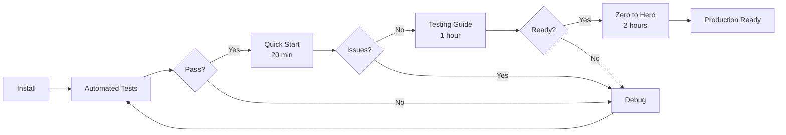

# Testing & Usage Guides

This directory contains step-by-step guides for testing and using Saber Code CLI.

## Available Guides

### 1. Quick Start Testing
**File**: [QUICK_START_TESTING.md](./QUICK_START_TESTING.md)  
**Duration**: ~20 minutes  
**Purpose**: Fast verification of core functionality

**What's Covered**:
- ✅ Prerequisites check (Ollama installation)
- ✅ Environment setup
- ✅ Basic CLI commands
- ✅ Plan creation and execution
- ✅ Error handling
- ✅ Expected outputs

**When to Use**: First-time setup, quick smoke test

---

### 2. Testing Guide
**File**: [TESTING_GUIDE.md](./TESTING_GUIDE.md)  
**Duration**: ~1 hour  
**Purpose**: Manual testing of AI-dependent features

**What's Covered**:
- ✅ 15 comprehensive manual tests
- ✅ Chat interaction testing
- ✅ Plan creation and validation
- ✅ Tool execution verification
- ✅ Context management
- ✅ Error scenarios
- ✅ Performance checks

**When to Use**: Pre-release testing, comprehensive validation

---

### 3. Zero to Hero Guide
**File**: [ZERO_TO_HERO.md](./ZERO_TO_HERO.md)  
**Duration**: ~2 hours  
**Purpose**: Complete validation of all features

**What's Covered**:
- ✅ 30 tests across 10 phases
- ✅ Environment setup
- ✅ Component testing
- ✅ CLI command testing
- ✅ Plan workflow testing
- ✅ Execution testing
- ✅ Advanced features
- ✅ Error recovery
- ✅ Performance testing
- ✅ Integration testing
- ✅ Production readiness

**When to Use**: Major release, comprehensive certification

---

## Testing Levels

### Automated Tests
```bash
# Quick (Component + Unit) - 2 seconds
npm test

# E2E tests - 3 seconds
npm run test:e2e

# All tests - ~10 seconds
npm run test:all
```

**Coverage**:
- ✅ 10 component tests
- ✅ 147 unit tests
- ✅ 10 E2E tests
- ✅ 13 TDD business tests
- **Total**: 180 tests, 100% passing

### Manual Tests
Required for features that need a running Ollama instance:
- AI chat interactions
- Plan generation with real AI
- Streaming responses
- Context-aware suggestions
- Multiple model testing

---

## Quick Reference

### Prerequisites
1. **Node.js**: v14+ installed
2. **Ollama**: Running on `localhost:11434`
3. **Model**: `qwen2.5-coder:32b-instruct` pulled
4. **Dependencies**: `npm install` completed

### Environment Setup
```bash
# Copy environment template
cp .env.example .env

# Pull recommended model
ollama pull qwen2.5-coder:32b-instruct

# Verify installation
npm test
```

### Common Commands
```bash
# Interactive chat
saber-code chat "How does this code work?"

# Create a plan
saber-code plan "Add user authentication"

# Execute latest plan
saber-code exec

# Search code
saber-code search "function.*User"

# Analyze file
saber-code analyze src/index.js

# List models
saber-code models
```

---

## Testing Strategy



---

## Troubleshooting

### Ollama Not Running
```bash
# Check if Ollama is running
curl http://localhost:11434/api/tags

# Start Ollama (if not running)
ollama serve
```

### Model Not Found
```bash
# List available models
ollama list

# Pull recommended model
ollama pull qwen2.5-coder:32b-instruct
```

### Tests Failing
```bash
# Run tests with verbose output
npm test -- --verbose

# Check specific test file
npx jest test/unit/config.test.js

# Run component tests
node test-components.js
```

### Command Not Found
```bash
# Link CLI globally
npm link

# Or use npx
npx saber-code chat "test"
```

---

## Test Checklist

### Before Starting
- [ ] Node.js installed (v14+)
- [ ] Ollama installed and running
- [ ] Model pulled (`qwen2.5-coder:32b-instruct`)
- [ ] Dependencies installed (`npm install`)
- [ ] Environment configured (`.env` file)

### Automated Testing
- [ ] Component tests pass (`node test-components.js`)
- [ ] Unit tests pass (`npm run test:unit`)
- [ ] E2E tests pass (`npm run test:e2e`)
- [ ] All tests pass (`npm run test:all`)

### Manual Testing
- [ ] Quick Start completed (20 min)
- [ ] Testing Guide completed (1 hour)
- [ ] Zero to Hero completed (2 hours)

### Production Ready
- [ ] All automated tests passing
- [ ] All manual tests completed
- [ ] Performance acceptable
- [ ] Error handling verified
- [ ] Documentation reviewed

---

## Guide Selection

| Scenario | Recommended Guide | Duration |
|----------|------------------|----------|
| First install | Quick Start | 20 min |
| Pre-commit | Automated Tests | 10 sec |
| Pre-release | Testing Guide | 1 hour |
| Major release | Zero to Hero | 2 hours |
| Bug report | Relevant section | Variable |
| New feature | Testing Guide | 1 hour |

---

## Related Documentation

- **ADRs**: [../adr/README.md](../adr/README.md) - Architecture decisions
- **Flow**: [../PROJECT_FLOW.md](../PROJECT_FLOW.md) - System diagrams
- **Research**: [../research/MODEL_COMPARISON.md](../research/MODEL_COMPARISON.md) - Model info

---

**Need Help?** Check the main [README.md](../../README.md) or review the [ADRs](../adr/README.md).
